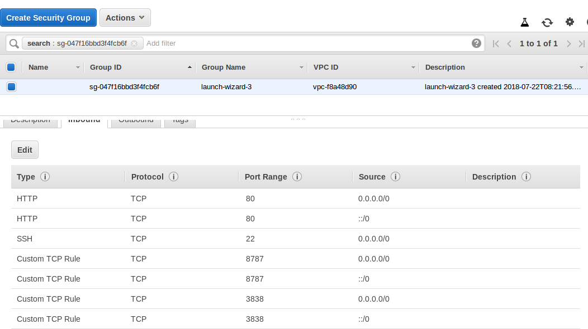

## Setup

### Installing R and R server

#### Installing R

R is a fast-moving project, and the latest stable version isn't always available from Ubuntu's repositories, so we'll start by adding the external repository maintained by CRAN:

`sudo apt-key adv --keyserver keyserver.ubuntu.com --recv-keys E298A3A825C0D65DFD57CBB651716619E084DAB9`

Once we have the trusted key in each server’s database, we can add the repository.

`sudo add-apt-repository 'deb [arch=amd64,i386] https://cran.rstudio.com/bin/linux/ubuntu xenial/'`

We'll need to run update after this in order to include package manifests from the new repository:

`sudo apt-get update`

If the lines above appear in the output from the update command, we've successfully added the repository. We can be sure we won't accidentally install an older version.

Now we're ready to install R:

`sudo apt-get install r-base`

#### Downloading and installing RStudio Server

To download and install RStudio Server open a terminal window and execute the following commands. Note that the gdebi-core package is installed first so that gdebi can be used to install RStudio and all of its dependencies.

`sudo apt-get install gdebi-core`

`wget https://download2.rstudio.org/rstudio-server-1.1.456-amd64.deb`

This might not be the latest RStudio Server version, please check the following [link](https://www.rstudio.com/products/rstudio/download-server/)

`sudo gdebi rstudio-server-1.1.456-amd64.deb`

Once you have done this don't forget to add an HTPP security group for port 80 in AWS and an *Custom TCP* for port 8787 (default for Rstudio-server) with **source::anywhere**, now you can use Rstudio-server

If you connect to your instance:8787 it will ask you for your username and password, your username will be ubuntu, and to set up your password you have to run the following code in the terminal

`sudo passwd ubuntu`

### Installing shiny server

You’ll also need to install the Shiny R package before installing Shiny Server:

 `sudo su - \ -c "R -e \"install.packages('shiny', repos='https://cran.rstudio.com/')\""`

Now dowload an install shiny server, the link of the lastest version is in this [link](https://www.rstudio.com/products/shiny/download-server/)

`wget https://download3.rstudio.org/ubuntu-14.04/x86_64/shiny-server-1.5.7.907-amd64.deb`
`sudo gdebi shiny-server-1.5.7.907-amd64.deb`

add port 3838 to the inbound security group just like it was done for the 8080 for the rstudio server

it should look like this:

### Installing Apache

Apache is open source web-server software that powers much of the web today. It is maintained by apache-http-project. Explore more [here](https://httpd.apache.org/)

`sudo apt-get update`
`sudo apt-get install apache2`
